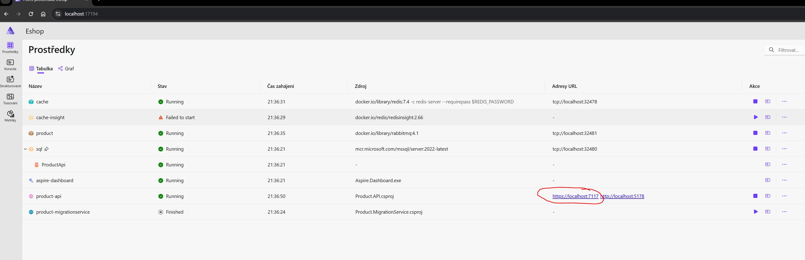
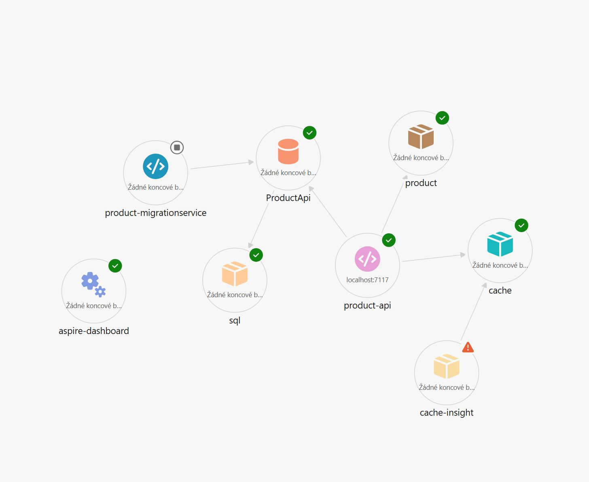

# Eshop Product API

## Getting Started

Product API is based on [.NET 9](https://learn.microsoft.com/en-us/dotnet/core/whats-new/dotnet-9/overview) and [Aspire](https://learn.microsoft.com/en-us/dotnet/aspire/get-started/aspire-overview)

### Prerequisites

- [Docker](https://docs.docker.com/engine/install/)
- [Visual Studio 2022 with updates or newer](https://visualstudio.microsoft.com/vs/)
- [.NET 9](https://dotnet.microsoft.com/en-us/download/dotnet/9.0)

### How to run Project

> [Run Docker](https://www.docker.com/blog/getting-started-with-docker-desktop/)
- Open Visual studio 
- [Run project Eshop.AppHost](https://learn.microsoft.com/en-us/visualstudio/get-started/csharp/run-program?view=vs-2022)
- Open site of Aspire
- 

### How to run UnitTests
- Open Visual studio
- [Click on 'Test' in Visual studio](https://learn.microsoft.com/en-us/visualstudio/test/run-unit-tests-with-test-explorer?view=vs-2022) 
- Click on 'Run all tests'

### Architecture of Aspire

- cache - Redis cache
- product-api - Gateway API
- ProductApi - MSSQL database
- sql - MSSQL server
- product - RabbitMQ
- product-migrationservice - Automatic migration (run when is project started or manualy)
